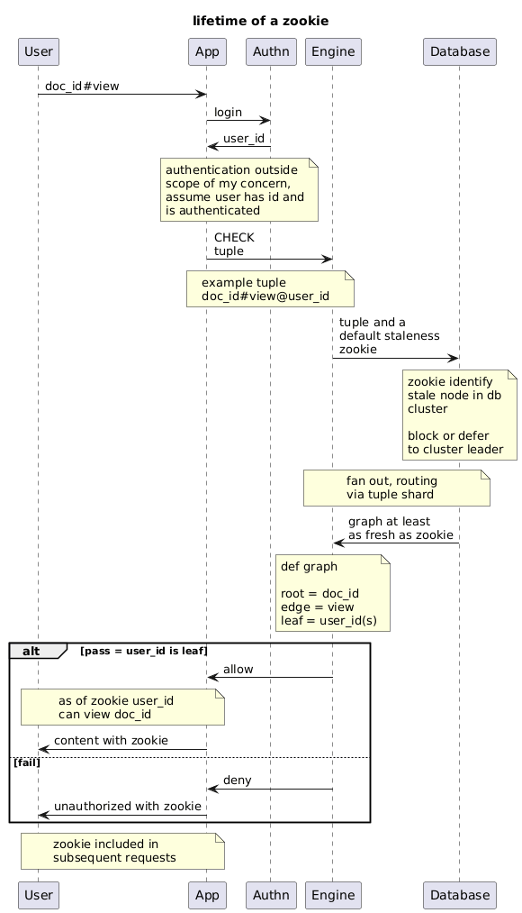

# Documentation

Scattered notes on my [comprehension](./comprehension.md). 

Below I am breaking down key parts from those notes to guide this project.

## Plant UML

Here are my breakdown of the different concepts as I understand them now. 

Diagrams generated with [planttext.com](https://www.planttext.com/).

### Zookie Lifetime

Explains 
- The lifetime of a zookie
- When a user does or does not have one
- When a user gets a new one
- When a zookie is useful

[plant uml](./uml/zookie_lifetime.plantuml) for the diagram

